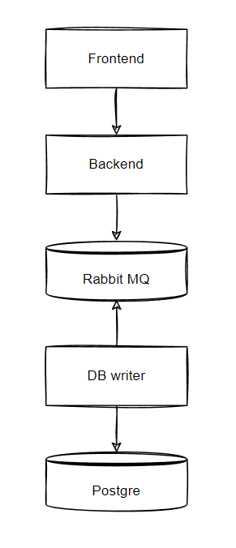

This is a project, based on the interview task one of my friends got once.

# The Task

This is not the original task text, but rather my interpretation based on my friend's recital.

> Your task is to implement a feedback messages service.
> It consists of 5 components:
> - frontend
> - backend
> - message broker (RabbitMQ)
> - db writer
> - db
>
> The project structure is:
> ```
>.
>├── frontend/
>├── backend/
>├── rabbitmq/
>├── dbwriter/
>├── db/
>└── docker-compose.yml
> ```
>  
> Each component should be represented as a Docker container. The `docker-compose up` command should launch the entire service.
> 
> ## Frontend
> A page with a feedback form. The fields are:
> - first name
> - last name
> - phone number
> - feedback message text
>
> It's a simple html+js page, which forms a JSON (or any other data representation) and sends it to backend.
>
> ## Backend
> This service receives data from frontend and pushes it to the message queue. 
> 
> **You should use Tornado web framework (Python).**
>
> ## Message broker
> **You should use RabbitMQ with management-plugin.**
>
> ## Database writer
> This service communicates with message broker, takes the messages from backend and writes it to the database.
>
> It is assumed that in future we'll be able to interact with it via API to change its behaviour and get some statistics reports. Though we won't implement any of this functionality now.
>
> **You should use FastAPI web framework (Python).**
>
> ## Database
> Any DB of your choice. The storage table should have the same fields as the frontend form.


# My implementation
<div align="center">



</div>

## Frontend

Nginx-based container. Static web-page. Pure javascript. Bootstrap.

## Backend

...

## RabbitMQ

I used `rabbitmq:3.11.3-management` image with default settings.

## Database writer
...

## Database
I used `postgres:15.1` image.